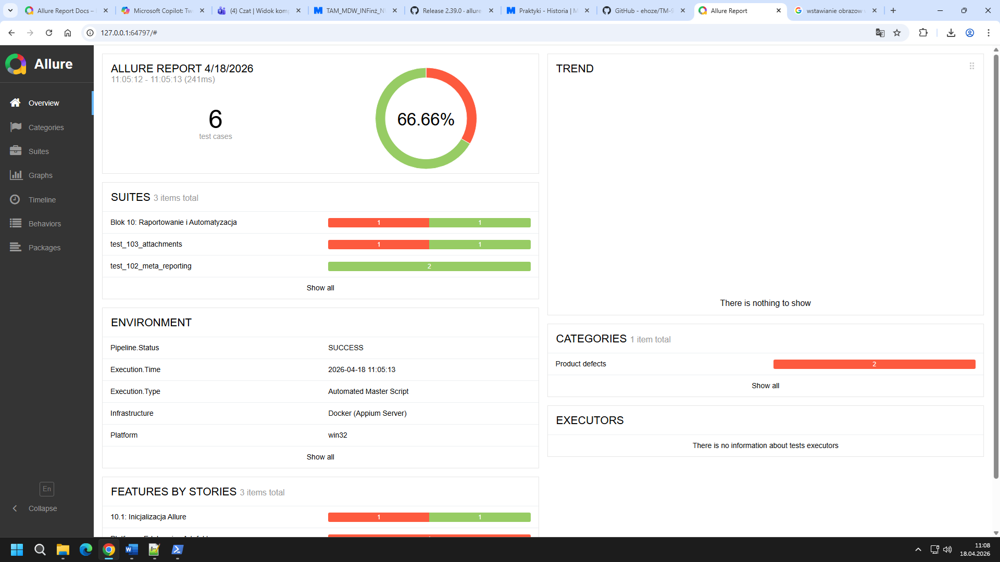

# 📱 Mobile Automation & Cloud-Ready Testing Suite

**Prowadzący:** mgr Mariusz Dworniczak  
**Student:** [Eryk Kucharski]  
**Numer Albumu:** [95072]

---

## 🏗️ Architektura Projektu (Marketing & Tech Stack)

Projekt stanowi kompletny ekosystem testów mobilnych oparty na podejściu **Cloud‑Ready / Headless**. Zamiast klasycznych emulatorów wykorzystuje narzędzia CLI, analizę statyczną, konteneryzację oraz automatyzację procesów CI/CD.

**Technologie użyte w projekcie:**
- **Python 3.10+** — logika testowa i pipeline
- **Appium 2.x** — silnik automatyzacji UI
- **Docker & Docker Compose** — izolacja środowiska testowego
- **Allure Framework** — raportowanie i metadane testów
- **MobSF & ADB CLI** — analiza statyczna i diagnostyka aplikacji

---

## 📅 Przebieg Laboratorium (Kamienie Milowe)

### 🔹 BLOK 1 — Tooling & Environment (Infrastruktura)
**Wniosek:** Kontenery są wygodniejsze od instalacji lokalnej, bo zapewniają powtarzalne środowisko, działają niezależnie od systemu operacyjnego i pozwalają szybko odtworzyć konfigurację na dowolnej maszynie.

### 🔹 BLOK 2 — Debugowanie i Analiza Statyczna (MobSF)
**Wniosek:** Analiza statyczna pozwala wcześnie wykryć podatności, błędne uprawnienia i niebezpieczne konfiguracje APK, zanim aplikacja zostanie uruchomiona lub trafi do testów dynamicznych.

### 🔹 BLOK 3–4 — Fundamenty Skryptowania (Python for QA)
**Wniosek:** Poznanie podstawowych struktur danych i funkcji w Pythonie ułatwia budowanie czytelnych, modularnych i łatwych w utrzymaniu testów automatycznych.

### 🔹 BLOK 5–7 — Hybrydowe Testowanie API (Requests & Pytest)
**Wniosek:** Testy API pozwalają szybko wykrywać błędy po stronie backendu, co skraca czas debugowania i zmniejsza liczbę problemów pojawiających się później w testach UI.

### 🔹 BLOK 8 — Appium UI Automation (Deep Dive)
**Wniosek:** Automatyzacja UI z Appium uczy pracy z selektorami i interakcjami mobilnymi, co pozwala tworzyć realistyczne scenariusze testowe odwzorowujące zachowanie użytkownika.

### 🔹 BLOK 9 — Konteneryzacja Serwera (Docker Compose)
Izolacja Appium od systemu operacyjnego.
- **Co wykonano:** Utworzenie `docker-compose.yml` zarządzającego serwerem Appium i sterownikami.

### 🔹 BLOK 10 — MASTER PIPELINE (Capstone Project) 🏆
Automatyzacja całego procesu testowego.
- **Co wykonano:** Skrypt `pipeline.py`, który:
  1. Uruchamia infrastrukturę Docker.
  2. Wykonuje testy API i UI.
  3. Generuje raport Allure.
  4. Czyści środowisko po zakończeniu pracy.

---

## 📊 Raportowanie Wyników (Allure)

System raportowania Allure umożliwia:
- Dokumentowanie kroków testowych (`@allure.step`)
- Analizę błędów z logami i zrzutami ekranu
- Dodawanie metadanych środowiskowych w sekcji **Environment**

****

---

## 🚀 Jak uruchomić cały proces?

```bash
# Przejdź do folderu projektu końcowego
cd Artefakt10

# Uruchom pełny pipeline
python3 pipeline.py

# Otwórz raport Allure
allure serve allure-results
